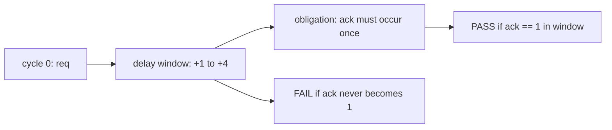
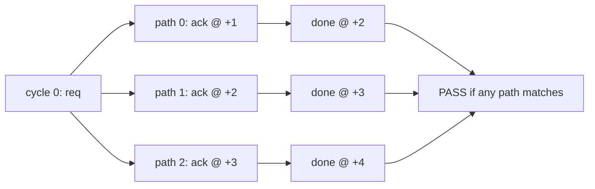
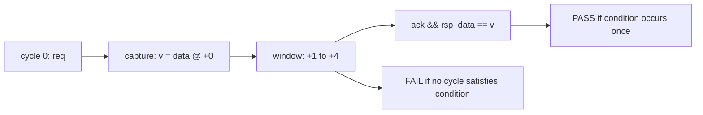

# xsva：基于 Python 的 SVA 语义编译、可视化与可理解化工具设计规范

## 一、工具定位

`xsva` 是一个面向芯片验证工程师和 AI Debug Agent 的 **SystemVerilog Assertion 语义编译工具**。

它的核心目标不是替代 VCS、VC Formal、JasperGold，也不是重新实现完整 SVA 仿真引擎，而是把 SVA 从“文本语法”转换成可理解、可审查、可测试、可被工具链消费的结构化语义表示。

典型输入：

```systemverilog
property p_req_ack;
  @(posedge clk) disable iff (!rst_n)
  req |-> ##[1:4] ack;
endproperty

a_req_ack: assert property (p_req_ack);
```

典型输出：

```text
Property:
  p_req_ack

Clock:
  posedge clk

Disable:
  disable iff (!rst_n)

Trigger:
  cycle 0:
    req

Implication:
  |-> overlapped implication.
  The consequent starts from cycle +0 relative to the trigger.

Obligation:
  cycle +1 to +4:
    ack must become true at least once.

Failure condition:
  req is true at cycle 0, but ack is never true from cycle +1 to cycle +4.
```

对应 JSON IR：

```json
{
  "schema_version": "xsva.timeline_ir.v1",
  "property": "p_req_ack",
  "kind": "assert",
  "clock": {
    "edge": "posedge",
    "signal": "clk",
    "supported": true
  },
  "disable": "!rst_n",
  "trigger": {
    "cycle": 0,
    "expr": "req",
    "captures": []
  },
  "obligations": [
    {
      "id": "ob_0",
      "kind": "eventually",
      "expr": "ack",
      "has_window": true,
      "window": {
        "start": 1,
        "end": 4,
        "unbounded": false
      },
      "requirement": "ack must become true at least once between cycle +1 and cycle +4"
    }
  ],
  "failure_conditions": [
    {
      "obligation_id": "ob_0",
      "condition": "ack is never true from cycle +1 to cycle +4"
    }
  ],
  "lowering_status": "exact",
  "diagnostics": []
}
```

`xsva` 的本质是：

```text
SVA source
  -> extraction
  -> parsing
  -> Surface IR
  -> Sequence Graph IR
  -> Obligation Timeline IR
  -> text / markdown / json / mermaid / svg
```

所有解释必须来自 IR。禁止让 LLM 直接对 SVA 原文自由解释。

---

## 二、核心设计原则

### 2.1 IR 是唯一事实源

所有输出都必须从 IR 生成：

```text
SVA source
  -> IR
  -> explanation / json / mermaid / svg
```

禁止：

```text
SVA source
  -> prompt
  -> LLM free explanation
```

原因是 SVA temporal semantic 很容易被误解，尤其是：

```systemverilog
|->
|=>
##[m:n]
first_match
throughout
intersect
local variable assignment
```

`xsva` 必须把这些语义确定性地编译成结构化结果。

### 2.2 能精确解释才解释

遇到无法精确 lowering 的语法，必须保守输出：

```json
{
  "lowering_status": "partial",
  "semantic_risk": "intersect is represented in Sequence Graph IR but not fully lowered to timeline"
}
```

不能为了输出完整自然语言而胡乱解释。

### 2.3 local variable 是 per-attempt 状态

SVA 中的 local variable assignment 不是普通 RTL 赋值。

```systemverilog
property p_data_match;
  logic [31:0] v;

  @(posedge clk) disable iff (!rst_n)
  (req, v = data) |-> ##[1:4] ack && rsp_data == v;
endproperty
```

含义是：

```text
当 req 触发 property attempt 时，捕获当时 data 的值，保存到当前 attempt 的局部变量 v。
后续 rsp_data == v 比较的是捕获值，不是当前周期的 data。
```

因此 IR 必须显式表达：

```text
capture point
capture value expression
local variable binding
per-attempt lifetime
later reference
```

### 2.4 range delay 后接 suffix sequence 必须路径化

```systemverilog
req |-> ##[1:3] ack ##1 done
```

不能简单解释为：

```text
ack 在 1 到 3 周期内出现，然后 done 出现。
```

必须展开为候选路径：

```text
path 0:
  ack at +1
  done at +2

path 1:
  ack at +2
  done at +3

path 2:
  ack at +3
  done at +4
```

因为 `done` 的检查周期依赖 `ack` 的匹配路径。

### 2.5 first_match 必须保留 earliest-match 语义

```systemverilog
req |-> first_match(##[1:4] ack) ##1 done
```

不能解释为：

```text
ack 在 +1 到 +4 任意出现，然后 done 出现。
```

正确语义是：

```text
在 +1 到 +4 的候选匹配范围内，只选择最早满足 ack 的那个匹配点；
随后 done 的检查周期以该最早匹配点为基准，再延后 1 个周期计算。
```

---

## 三、Python 实现定位

`xsva` 使用 Python 作为最终交付语言。

推荐约束：

```text
Python >= 3.10
核心功能零第三方依赖
开发测试可使用 pytest
CLI 使用 argparse
IR 使用 dataclass + enum
JSON 输出使用标准库 json
路径处理使用 pathlib
```

不建议核心功能依赖复杂 parser generator。第一版 parser 采用 deterministic scanner + small recursive parser 的方式实现。

理由：

```text
1. SVA 子集可控。
2. top-level implication 需要特殊扫描。
3. unsupported construct 需要保守降级。
4. 表达式可以先保留 raw string。
5. IR 和 golden test 比 parser 完整性更重要。
```

---

## 四、Python 包结构

推荐目录：

```text
xsva/
├── pyproject.toml
├── README.md
├── docs/
│   └── xsva_design_spec.md
│
├── xsva/
│   ├── __init__.py
│   ├── __main__.py
│   ├── cli.py
│   │
│   ├── frontend/
│   │   ├── __init__.py
│   │   ├── source.py
│   │   ├── comments.py
│   │   ├── macros.py
│   │   └── extractor.py
│   │
│   ├── parser/
│   │   ├── __init__.py
│   │   ├── scan.py
│   │   ├── property_parser.py
│   │   ├── sequence_parser.py
│   │   ├── expr_scan.py
│   │   └── local_assign.py
│   │
│   ├── ir/
│   │   ├── __init__.py
│   │   ├── common.py
│   │   ├── diagnostics.py
│   │   ├── surface.py
│   │   ├── expr.py
│   │   ├── sequence.py
│   │   ├── timeline.py
│   │   └── evidence.py
│   │
│   ├── lower/
│   │   ├── __init__.py
│   │   ├── surface_to_sequence.py
│   │   ├── sequence_to_timeline.py
│   │   └── path_expand.py
│   │
│   ├── explain/
│   │   ├── __init__.py
│   │   ├── text.py
│   │   ├── markdown.py
│   │   ├── mermaid.py
│   │   └── svg.py
│   │
│   ├── lint/
│   │   ├── __init__.py
│   │   ├── rules.py
│   │   ├── vacuity.py
│   │   ├── temporal.py
│   │   └── local_var.py
│   │
│   └── util/
│       ├── __init__.py
│       ├── json.py
│       └── errors.py
│
└── tests/
    ├── golden_ir/
    ├── parser/
    ├── lowering/
    ├── render/
    └── real_cases/
```

---

## 五、CLI 设计

### 5.1 命令总览

```bash
xsva scan --file prop.sv
xsva list --file prop.sv
xsva lint --file prop.sv

xsva explain --file prop.sv --property p_req_ack
xsva explain --file prop.sv --property p_req_ack --json
xsva explain --file prop.sv --property p_req_ack --markdown

xsva parse --file prop.sv --property p_req_ack --emit surface-ir
xsva parse --file prop.sv --property p_req_ack --emit sequence-ir
xsva parse --file prop.sv --property p_req_ack --emit timeline-ir

xsva render --file prop.sv --property p_req_ack --format mermaid
xsva render --file prop.sv --property p_req_ack --format svg
```

### 5.2 `xsva list`

列出文件中的 property / assertion。

```bash
xsva list --file prop.sv
```

输出：

```text
Properties:
  p_req_ack
  p_data_match

Assertions:
  a_req_ack: assert property (p_req_ack)
  a_data_match: assert property (p_data_match)

Inline assertions:
  unnamed_assert_0
```

### 5.3 `xsva scan`

扫描语法构造分布。

```bash
xsva scan --file prop.sv
```

输出：

```text
File:
  prop.sv

Property blocks:
  12

Inline assertions:
  4

Operators:
  |->              8
  |=>              3
  ##N              5
  ##[m:n]          4
  [*]              2
  $stable          3
  $past            2
  $rose            1
  $fell            1
  local_assign     2
  first_match      1
  throughout       1
  intersect        0
  within           0
  unsupported      1
```

### 5.4 `xsva explain`

```bash
xsva explain --file prop.sv --property p_req_ack
```

输出文本解释。

可选参数：

```bash
--json
--markdown
--strict
--max-expand-paths 32
--show-sequence-ir
--show-surface-ir
```

### 5.5 `xsva parse`

```bash
xsva parse --file prop.sv --property p_req_ack --emit surface-ir
xsva parse --file prop.sv --property p_req_ack --emit sequence-ir
xsva parse --file prop.sv --property p_req_ack --emit timeline-ir
```

### 5.6 `xsva render`

```bash
xsva render --file prop.sv --property p_req_ack --format mermaid
xsva render --file prop.sv --property p_req_ack --format svg
```

### 5.7 exit code

```text
0  success
1  parse error
2  unsupported construct in strict mode
3  property not found
4  file error
5  internal error
```

---

## 六、IR 总体结构

`xsva` 使用四类 IR：

```text
Surface IR
  保存 property 外壳、clock、disable、antecedent/consequent 原文

Sequence Graph IR
  保存 SVA sequence 的结构，包括 delay、repeat、intersect、throughout、local assignment

Obligation Timeline IR
  保存 trigger、obligation、window、path、failure condition

Evidence IR
  预留给后续波形/反例解释使用
```

所有 IR 都必须支持 JSON 序列化。

推荐实现方式：

```python
from dataclasses import dataclass, field, asdict
from enum import Enum
from typing import Optional, Any
```

公共结构放在：

```text
xsva/ir/common.py
xsva/ir/diagnostics.py
```

---

## 七、公共 IR 定义

### 7.1 SourceSpan

```python
from dataclasses import dataclass

@dataclass
class SourceSpan:
    file: str = ""
    begin_line: int = 0
    begin_col: int = 0
    end_line: int = 0
    end_col: int = 0
```

### 7.2 LoweringStatus

```python
from enum import Enum

class LoweringStatus(str, Enum):
    EXACT = "exact"
    PARTIAL = "partial"
    OPAQUE = "opaque"
    UNSUPPORTED = "unsupported"
    UNSAFE_TO_EXPLAIN = "unsafe_to_explain"
```

| 状态 | 含义 |
|---|---|
| `exact` | 可精确 lowering |
| `partial` | 可解释一部分，但有语义损失 |
| `opaque` | 能识别结构，但不展开内部语义 |
| `unsupported` | 当前不支持 |
| `unsafe_to_explain` | 强行解释会误导 |

### 7.3 DiagnosticIR

```python
from dataclasses import dataclass, field

@dataclass
class DiagnosticIR:
    code: str
    severity: str
    message: str
    span: SourceSpan = field(default_factory=SourceSpan)
```

severity：

```text
info
warning
error
```

---

## 八、Surface IR

文件：

```text
xsva/ir/surface.py
```

定义：

```python
from dataclasses import dataclass, field
from typing import List
from xsva.ir.common import SourceSpan
from xsva.ir.diagnostics import DiagnosticIR

@dataclass
class ClockIR:
    edge: str = "unknown"       # posedge / negedge / edge / unknown
    signal: str = ""
    supported: bool = True

@dataclass
class LocalVarIR:
    name: str
    type: str
    scope: str = "property"     # property / sequence
    lifetime: str = "per_attempt"
    span: SourceSpan = field(default_factory=SourceSpan)

@dataclass
class SurfaceIR:
    schema_version: str = "xsva.surface_ir.v1"

    name: str = ""
    label: str = ""
    kind: str = "assert"        # assert / assume / cover / property

    raw_text: str = ""

    clock: ClockIR = field(default_factory=ClockIR)
    disable_expr: str = ""

    local_vars: List[LocalVarIR] = field(default_factory=list)

    antecedent_raw: str = ""
    implication: str = ""       # |-> / |=>
    consequent_raw: str = ""

    is_named_property: bool = False
    is_inline_property: bool = False

    span: SourceSpan = field(default_factory=SourceSpan)
    diagnostics: List[DiagnosticIR] = field(default_factory=list)
```

JSON 示例：

```json
{
  "schema_version": "xsva.surface_ir.v1",
  "name": "p_req_ack",
  "kind": "assert",
  "clock": {
    "edge": "posedge",
    "signal": "clk",
    "supported": true
  },
  "disable_expr": "!rst_n",
  "local_vars": [],
  "antecedent_raw": "req",
  "implication": "|->",
  "consequent_raw": "##[1:4] ack",
  "is_named_property": true,
  "is_inline_property": false,
  "diagnostics": []
}
```

---

## 九、Expression IR

文件：

```text
xsva/ir/expr.py
```

`xsva` 不做完整 SystemVerilog expression evaluator，但需要识别表达式中的信号、local variable、sampled value function。

```python
from dataclasses import dataclass, field
from enum import Enum
from typing import List
from xsva.ir.common import SourceSpan

class ExprKind(str, Enum):
    RAW = "raw"
    IDENTIFIER = "identifier"
    LITERAL = "literal"
    SYSTEM_FUNC = "system_func"
    UNARY = "unary"
    BINARY = "binary"
    OPAQUE = "opaque"

@dataclass
class SampleDependencyIR:
    func: str
    expr: str
    current_cycle: int
    reference_cycle: int | None = None
    depth: int | None = None

@dataclass
class ExprIR:
    kind: ExprKind = ExprKind.RAW
    raw: str = ""

    op: str = ""
    operands: List["ExprIR"] = field(default_factory=list)

    signals: List[str] = field(default_factory=list)
    local_refs: List[str] = field(default_factory=list)

    sampled_funcs: List[str] = field(default_factory=list)
    sample_dependencies: List[SampleDependencyIR] = field(default_factory=list)

    contains_x_sensitive_op: bool = False
    contains_sampled_func: bool = False

    span: SourceSpan = field(default_factory=SourceSpan)
```

需要识别：

```systemverilog
$stable(expr)
$past(expr)
$past(expr, N)
$rose(expr)
$fell(expr)
$changed(expr)
$isunknown(expr)
```

| 函数 | 语义 |
|---|---|
| `$stable(x)` | 当前采样值等于上一采样值 |
| `$past(x)` | 上一个采样周期的 x |
| `$past(x, N)` | N 个采样周期前的 x |
| `$rose(x)` | x 从 0 变为 1 |
| `$fell(x)` | x 从 1 变为 0 |
| `$changed(x)` | x 当前采样值与上一采样值不同 |
| `$isunknown(x)` | x 包含 X/Z |

表达式扫描器不需要完整求值，只需要提取：

```text
signals
local_refs
sampled_funcs
sample_dependencies
```

示例：

```systemverilog
valid && $stable(data)
```

可生成：

```json
{
  "raw": "valid && $stable(data)",
  "signals": ["valid", "data"],
  "local_refs": [],
  "sampled_funcs": ["$stable"],
  "sample_dependencies": [
    {
      "func": "$stable",
      "expr": "data",
      "current_cycle": 1,
      "reference_cycle": 0
    }
  ]
}
```

---

## 十、Sequence Graph IR

文件：

```text
xsva/ir/sequence.py
```

Sequence Graph IR 是 `xsva` 的核心内部 IR，用来表达 SVA sequence 的结构语义。它不直接服务最终用户，而是服务 lowering、路径展开、保守降级和后续 evidence replay。

### 10.1 节点类型

```python
from enum import Enum

class SeqNodeKind(str, Enum):
    EXPR = "expr"
    MATCH_ITEM = "match_item"
    DELAY = "delay"
    CONCAT = "concat"
    REPEAT = "repeat"
    AND = "and"
    OR = "or"
    INTERSECT = "intersect"
    THROUGHOUT = "throughout"
    WITHIN = "within"
    FIRST_MATCH = "first_match"
    STRONG = "strong"
    WEAK = "weak"
    OPAQUE = "opaque"
```

| Node | 含义 |
|---|---|
| `EXPR` | 普通布尔表达式 |
| `MATCH_ITEM` | 带 guard 和 action 的匹配项，例如 `(req, v = data)` |
| `DELAY` | `##N` 或 `##[m:n]` |
| `CONCAT` | sequence 串接 |
| `REPEAT` | `[*]`、`[->]`、`[=]` |
| `AND` | sequence-level `and` |
| `OR` | sequence-level `or` |
| `INTERSECT` | 两个 sequence 同时开始且同时结束 |
| `THROUGHOUT` | 某表达式在 sequence 匹配区间内保持为真 |
| `WITHIN` | 一个 sequence 匹配区间包含于另一个 sequence |
| `FIRST_MATCH` | 选择最早匹配路径 |
| `STRONG` | strong sequence/property wrapper |
| `WEAK` | weak sequence/property wrapper |
| `OPAQUE` | 能识别但不能安全展开的结构 |

### 10.2 AssignActionIR

SVA local variable assignment 必须建模成 action。

```python
from dataclasses import dataclass, field
from xsva.ir.common import SourceSpan

@dataclass
class AssignActionIR:
    lhs: str
    rhs: str
    action_kind: str = "capture"   # capture / update
    span: SourceSpan = field(default_factory=SourceSpan)
```

判定规则：

```text
v = data
  -> capture

cnt = cnt + 1
  -> update
```

如果 RHS 引用了 LHS，则视为 update；如果 RHS 不引用 LHS，则默认视为 capture。

### 10.3 SeqNode

```python
from dataclasses import dataclass, field
from typing import List
from xsva.ir.common import SourceSpan, LoweringStatus
from xsva.ir.expr import ExprIR

@dataclass
class SeqNode:
    kind: SeqNodeKind
    lowering_status: LoweringStatus = LoweringStatus.EXACT

    raw: str = ""
    expr: ExprIR = field(default_factory=ExprIR)

    # Match item
    guard_expr: ExprIR = field(default_factory=ExprIR)
    actions: List[AssignActionIR] = field(default_factory=list)

    # Delay
    min_delay: int = 0
    max_delay: int = 0
    unbounded: bool = False

    # Repeat
    repeat_kind: str = ""          # consecutive / goto / nonconsecutive
    repeat_min: int = 0
    repeat_max: int = 0
    repeat_unbounded: bool = False

    # Tree
    children: List["SeqNode"] = field(default_factory=list)

    semantic_risk: str = ""
    span: SourceSpan = field(default_factory=SourceSpan)
```

### 10.4 MatchItem 示例

输入：

```systemverilog
(req, v = data)
```

Sequence IR：

```json
{
  "kind": "match_item",
  "guard_expr": {
    "raw": "req"
  },
  "actions": [
    {
      "lhs": "v",
      "rhs": "data",
      "action_kind": "capture"
    }
  ]
}
```

输入：

```systemverilog
(req, v_id = id, v_data = data)
```

Sequence IR：

```json
{
  "kind": "match_item",
  "guard_expr": {
    "raw": "req"
  },
  "actions": [
    {
      "lhs": "v_id",
      "rhs": "id",
      "action_kind": "capture"
    },
    {
      "lhs": "v_data",
      "rhs": "data",
      "action_kind": "capture"
    }
  ]
}
```

输入：

```systemverilog
(cnt = cnt + 1)
```

Sequence IR：

```json
{
  "kind": "match_item",
  "guard_expr": {
    "raw": "1"
  },
  "actions": [
    {
      "lhs": "cnt",
      "rhs": "cnt + 1",
      "action_kind": "update"
    }
  ],
  "lowering_status": "partial",
  "semantic_risk": "local variable update creates path-dependent state"
}
```

---

## 十一、Timeline IR

文件：

```text
xsva/ir/timeline.py
```

Timeline IR 是最终解释、JSON 输出、Mermaid/SVG 可视化和 Agent 使用的核心 IR。它的目标是把 SVA 语义表达成：

```text
trigger
capture
obligation
window
match path
failure condition
vacuity check
diagnostic
```

### 11.1 IR 定义

```python
from dataclasses import dataclass, field
from typing import List
from xsva.ir.common import LoweringStatus
from xsva.ir.diagnostics import DiagnosticIR
from xsva.ir.surface import ClockIR

@dataclass
class CaptureIR:
    var: str
    value_expr: str
    relative_cycle: int
    meaning: str = ""

@dataclass
class TriggerIR:
    cycle: int = 0
    expr: str = ""
    captures: List[CaptureIR] = field(default_factory=list)

@dataclass
class WindowIR:
    start: int = 0
    end: int = 0
    unbounded: bool = False

@dataclass
class ObligationIR:
    id: str
    kind: str                         # point / eventually / hold / stable / rose / fell / compare_past / sequence_path
    expr: str = ""

    has_cycle: bool = False
    cycle: int = 0

    has_window: bool = False
    window: WindowIR = field(default_factory=WindowIR)

    depends_on_captures: List[str] = field(default_factory=list)
    requirement: str = ""

@dataclass
class MatchPathIR:
    id: str
    captures: List[CaptureIR] = field(default_factory=list)
    obligations: List[ObligationIR] = field(default_factory=list)
    pass_condition: str = ""
    failure_condition: str = ""

@dataclass
class FailureConditionIR:
    obligation_id: str
    condition: str

@dataclass
class TimelineIR:
    schema_version: str = "xsva.timeline_ir.v1"

    property: str = ""
    kind: str = "assert"

    clock: ClockIR = field(default_factory=ClockIR)
    disable_expr: str = ""

    trigger: TriggerIR = field(default_factory=TriggerIR)

    obligations: List[ObligationIR] = field(default_factory=list)
    match_paths: List[MatchPathIR] = field(default_factory=list)

    failure_conditions: List[FailureConditionIR] = field(default_factory=list)
    vacuity_checks: List[str] = field(default_factory=list)

    diagnostics: List[DiagnosticIR] = field(default_factory=list)

    lowering_status: LoweringStatus = LoweringStatus.EXACT
```

### 11.2 Obligation kind

| kind | 含义 |
|---|---|
| `point` | 固定周期检查 |
| `eventually` | 窗口内至少发生一次 |
| `hold` | 在窗口内持续保持 |
| `stable` | `$stable` 语义 |
| `rose` | `$rose` 语义 |
| `fell` | `$fell` 语义 |
| `compare_past` | 使用 `$past` 的比较 |
| `sequence_path` | path-based sequence obligation |

---

## 十二、Evidence IR

文件：

```text
xsva/ir/evidence.py
```

Evidence IR 用于后续接波形、FSDB、VCD、formal counterexample、VCS assertion failure log。

```python
from dataclasses import dataclass, field
from typing import Dict, List
from xsva.ir.timeline import WindowIR

@dataclass
class BindingValueIR:
    var: str
    source_expr: str
    sample_cycle: int
    sample_time: str = ""
    value: str = ""

@dataclass
class SignalSampleIR:
    cycle: int
    time: str = ""
    signals: Dict[str, str] = field(default_factory=dict)
    locals: Dict[str, str] = field(default_factory=dict)
    expr_result: bool | None = None
    reason: str = ""

@dataclass
class ObligationResultIR:
    obligation_id: str
    status: str                         # passed / failed / unknown
    absolute_window: WindowIR = field(default_factory=WindowIR)
    samples: List[SignalSampleIR] = field(default_factory=list)
    failure_reason: str = ""

@dataclass
class EvidenceIR:
    schema_version: str = "xsva.evidence_ir.v1"

    property: str = ""
    attempt_id: str = ""

    trigger_cycle: int = 0
    trigger_time: str = ""
    trigger_expr: str = ""
    trigger_value: bool | None = None

    bindings: List[BindingValueIR] = field(default_factory=list)
    obligation_results: List[ObligationResultIR] = field(default_factory=list)

    final_status: str = "unknown"        # pass / fail / unknown
```

Evidence IR 示例：

```json
{
  "schema_version": "xsva.evidence_ir.v1",
  "property": "p_data_match",
  "attempt_id": "attempt_100",
  "trigger_cycle": 100,
  "trigger_time": "1000ns",
  "trigger_expr": "req",
  "trigger_value": true,
  "bindings": [
    {
      "var": "v",
      "source_expr": "data",
      "sample_cycle": 100,
      "sample_time": "1000ns",
      "value": "32'h1234"
    }
  ],
  "obligation_results": [
    {
      "obligation_id": "ob_0",
      "status": "failed",
      "absolute_window": {
        "start": 101,
        "end": 104,
        "unbounded": false
      },
      "samples": [
        {
          "cycle": 102,
          "time": "1020ns",
          "signals": {
            "ack": "1",
            "rsp_data": "32'h5678"
          },
          "locals": {
            "v": "32'h1234"
          },
          "expr_result": false,
          "reason": "rsp_data != captured v"
        }
      ],
      "failure_reason": "no cycle in the required window satisfies ack && rsp_data == captured v"
    }
  ],
  "final_status": "fail"
}
```

---

## 十三、Frontend 设计

Frontend 负责读取源码、去注释、检测宏、抽取 property/assertion。

### 13.1 source.py

职责：

```text
1. 读取文件
2. 统一换行
3. 保存 file path
4. 提供 offset 到 line/column 的映射
```

定义：

```python
from dataclasses import dataclass

@dataclass
class SourceFile:
    path: str
    text: str

    def line_col(self, offset: int) -> tuple[int, int]:
        ...
```

### 13.2 comments.py

接口：

```python
def remove_comments_keep_lines(src: str) -> str:
    ...
```

要求：

```text
1. 删除 // 注释。
2. 删除 /* ... */ 注释。
3. 保留换行。
4. 字符串中的 // 和 /* 不作为注释。
```

### 13.3 macros.py

接口：

```python
def detect_macros(src: str) -> list[DiagnosticIR]:
    ...
```

检测：

```systemverilog
`define
`ifdef
`ifndef
`elsif
`else
`endif
`include
```

输出：

```text
XSVA-W009:
  Macro detected. Preprocess source for accurate parsing.
```

`xsva` 不负责宏展开。如果用户需要准确解析宏，应输入预处理后的 `.sv` 文件。

### 13.4 extractor.py

职责：

```text
1. 抽取 property ... endproperty。
2. 抽取 assert property (...)。
3. 抽取 assume property (...)。
4. 抽取 cover property (...)。
5. 建立 property symbol table。
```

定义：

```python
from dataclasses import dataclass, field
from xsva.ir.common import SourceSpan
from xsva.ir.surface import LocalVarIR

@dataclass
class PropertySymbol:
    name: str
    body: str
    local_vars: list[LocalVarIR]
    span: SourceSpan

@dataclass
class AssertionSymbol:
    label: str
    kind: str              # assert / assume / cover
    is_ref: bool
    property_ref: str = ""
    inline_body: str = ""
    span: SourceSpan = field(default_factory=SourceSpan)

@dataclass
class SymbolTable:
    properties: dict[str, PropertySymbol] = field(default_factory=dict)
    assertions: dict[str, AssertionSymbol] = field(default_factory=dict)
    inline_assertions: list[AssertionSymbol] = field(default_factory=list)
```

### 13.5 property block 抽取规则

支持：

```systemverilog
property p0;
  @(posedge clk) req |-> ack;
endproperty
```

抽取：

```text
name = p0
body = @(posedge clk) req |-> ack;
```

支持 local variable declaration：

```systemverilog
property p_data;
  logic [31:0] v;
  int cnt;

  @(posedge clk) (req, v = data) |-> ##1 rsp == v;
endproperty
```

### 13.6 assertion 抽取规则

支持 reference：

```systemverilog
a0: assert property (p0);
```

抽取：

```text
label = a0
kind = assert
is_ref = true
property_ref = p0
```

支持 inline：

```systemverilog
a1: assert property (@(posedge clk) req |-> ack);
```

抽取：

```text
label = a1
kind = assert
is_ref = false
inline_body = @(posedge clk) req |-> ack
```

支持无 label：

```systemverilog
assert property (@(posedge clk) req |-> ack);
```

自动命名：

```text
unnamed_assert_0
unnamed_assert_1
```

---

## 十四、Property parser 设计

文件：

```text
xsva/parser/property_parser.py
```

Property parser 负责从 property body 中抽取：

```text
clock
disable iff
antecedent
implication
consequent
```

### 14.1 clock 抽取

接口：

```python
def extract_clock(body: str) -> tuple[ClockIR, str, list[DiagnosticIR]]:
    ...
```

支持：

```systemverilog
@(posedge clk)
@(negedge clk)
@(edge clk)
```

输入：

```systemverilog
@(posedge clk) disable iff (!rst_n) req |-> ack
```

输出：

```python
ClockIR(edge="posedge", signal="clk", supported=True)
remaining = "disable iff (!rst_n) req |-> ack"
```

不支持 multi-clock：

```systemverilog
@(posedge clk1) req |-> @(posedge clk2) ack
```

输出：

```text
XSVA-W008:
  Multi-clock property is not fully supported.
```

### 14.2 disable iff 抽取

接口：

```python
def extract_disable_iff(body: str) -> tuple[str, str, list[DiagnosticIR]]:
    ...
```

支持：

```systemverilog
disable iff (!rst_n)
disable iff (reset || flush)
```

输入：

```systemverilog
disable iff (!rst_n) req |-> ack
```

输出：

```text
disable_expr = !rst_n
remaining = req |-> ack
```

要求使用括号匹配，不能使用简单正则截断。

### 14.3 top-level implication 查找

接口：

```python
def find_top_level_implication(s: str) -> tuple[int, str] | None:
    ...
```

扫描时维护：

```text
paren_depth
bracket_depth
brace_depth
string_literal_state
```

只在所有 depth 为 0 时识别：

```text
|->
|=>
```

示例：

```systemverilog
(req && (a |-> b)) |-> ack
```

正确识别的是最外层第二个 `|->`。

### 14.4 local variable declaration 抽取

接口：

```python
def extract_local_vars(property_body: str) -> tuple[list[LocalVarIR], str]:
    ...
```

支持：

```systemverilog
logic [31:0] v;
int cnt;
bit flag;
```

输出：

```python
[
  LocalVarIR(name="v", type="logic [31:0]", scope="property"),
  LocalVarIR(name="cnt", type="int", scope="property"),
  LocalVarIR(name="flag", type="bit", scope="property")
]
```

剩余 body 去掉 declaration。

---

## 十五、Sequence parser 设计

文件：

```text
xsva/parser/sequence_parser.py
```

Sequence parser 解析 consequent 和 antecedent 中的 sequence 结构。

### 15.1 总入口

```python
def parse_sequence(raw: str) -> SeqNode:
    ...
```

输入：

```systemverilog
##[1:3] ack ##1 done
```

输出：

```text
Concat(
  Delay(1,3),
  Expr(ack),
  Delay(1,1),
  Expr(done)
)
```

### 15.2 顶层扫描工具

文件：

```text
xsva/parser/scan.py
```

提供：

```python
def split_top_level(s: str, sep: str) -> list[str]:
    ...

def find_top_level_keyword(s: str, keywords: list[str]) -> tuple[int, str] | None:
    ...

def strip_outer_parens(s: str) -> str:
    ...

def has_balanced_outer_parens(s: str) -> bool:
    ...
```

扫描时维护：

```text
paren_depth
bracket_depth
brace_depth
string_literal_state
```

### 15.3 delay 解析

接口：

```python
def parse_delay_at(s: str, pos: int) -> tuple[SeqNode, int] | None:
    ...
```

支持：

```systemverilog
##1
##[1:4]
##[0:$]
```

输出：

```python
SeqNode(
    kind=SeqNodeKind.DELAY,
    min_delay=1,
    max_delay=4,
    unbounded=False,
    raw="##[1:4]"
)
```

`$` 表示 unbounded：

```python
SeqNode(
    kind=SeqNodeKind.DELAY,
    min_delay=0,
    max_delay=-1,
    unbounded=True,
    raw="##[0:$]"
)
```

### 15.4 concat 解析

算法：

```text
1. 从左到右扫描 raw sequence。
2. 在 top-level 识别 ##N / ##[m:n]。
3. delay 前的 buffer 解析为 Expr / MatchItem / Repeat / AdvancedNode。
4. delay 解析为 DelayNode。
5. 多个节点包成 ConcatNode。
```

示例：

```systemverilog
ack ##1 done
```

输出：

```text
Concat(
  Expr(ack),
  Delay(1,1),
  Expr(done)
)
```

### 15.5 match item 解析

接口：

```python
def parse_match_item(raw: str) -> SeqNode | None:
    ...
```

识别：

```systemverilog
(req, v = data)
(req, v_id = id, v_data = data)
```

判定条件：

```text
1. raw 外层是括号。
2. 括号内存在 top-level comma。
3. 第一个字段作为 guard。
4. 后续字段如果存在 assignment，则作为 action。
```

assignment 判定：

```text
识别单个 =
排除 ==
排除 !=
排除 <=
排除 >=
排除 ===
排除 !==
```

### 15.6 repeat 解析

接口：

```python
def parse_repeat_suffix(raw: str) -> SeqNode | None:
    ...
```

支持：

```systemverilog
ack[*3]
ack[*1:4]
ack[*0:$]
```

输出：

```python
SeqNode(
    kind=SeqNodeKind.REPEAT,
    repeat_kind="consecutive",
    repeat_min=1,
    repeat_max=4,
    repeat_unbounded=False,
    children=[
        SeqNode(kind=SeqNodeKind.EXPR, expr=ExprIR(raw="ack"))
    ]
)
```

识别但保守处理：

```systemverilog
ack[->2]
ack[=2]
```

输出：

```python
SeqNode(
    kind=SeqNodeKind.REPEAT,
    repeat_kind="goto",
    lowering_status=LoweringStatus.OPAQUE,
    semantic_risk="goto repetition endpoint semantics require careful lowering",
    raw="ack[->2]"
)
```

### 15.7 advanced sequence 解析

必须识别：

```systemverilog
first_match(...)
expr throughout seq
seq1 within seq2
seq1 intersect seq2
strong(...)
weak(...)
```

对应 node：

```text
SeqNodeKind.FIRST_MATCH
SeqNodeKind.THROUGHOUT
SeqNodeKind.WITHIN
SeqNodeKind.INTERSECT
SeqNodeKind.STRONG
SeqNodeKind.WEAK
```

无法解析内部时使用：

```text
SeqNodeKind.OPAQUE
```

并设置：

```python
lowering_status = LoweringStatus.OPAQUE
semantic_risk = "..."
```

---

## 十六、Lowering 设计

文件：

```text
xsva/lower/surface_to_sequence.py
xsva/lower/sequence_to_timeline.py
xsva/lower/path_expand.py
```

### 16.1 总入口

```python
def lower_surface_to_sequence(surface: SurfaceIR) -> tuple[SeqNode, SeqNode]:
    ...

def lower_sequence_to_timeline(
    surface: SurfaceIR,
    antecedent: SeqNode,
    consequent: SeqNode,
    max_expand_paths: int = 32,
) -> TimelineIR:
    ...
```

`lower_surface_to_sequence` 返回：

```text
antecedent_seq
consequent_seq
```

### 16.2 implication offset

```python
def implication_offset(op: str) -> int:
    if op == "|->":
        return 0
    if op == "|=>":
        return 1
    raise ValueError(f"unsupported implication: {op}")
```

含义：

```text
|-> : consequent 从 trigger cycle +0 开始
|=> : consequent 从 trigger cycle +1 开始
```

### 16.3 trigger lowering

antecedent 是普通表达式：

```systemverilog
req |-> ack
```

Trigger IR：

```json
{
  "cycle": 0,
  "expr": "req",
  "captures": []
}
```

antecedent 是 MatchItem：

```systemverilog
(req, v = data) |-> ##1 rsp == v
```

Trigger IR：

```json
{
  "cycle": 0,
  "expr": "req",
  "captures": [
    {
      "var": "v",
      "value_expr": "data",
      "relative_cycle": 0,
      "meaning": "capture data at trigger cycle"
    }
  ]
}
```

### 16.4 A |-> B

输入：

```systemverilog
A |-> B
```

Timeline：

```json
{
  "trigger": {
    "cycle": 0,
    "expr": "A"
  },
  "obligations": [
    {
      "id": "ob_0",
      "kind": "point",
      "has_cycle": true,
      "cycle": 0,
      "expr": "B"
    }
  ]
}
```

### 16.5 A |=> B

输入：

```systemverilog
A |=> B
```

Timeline：

```json
{
  "trigger": {
    "cycle": 0,
    "expr": "A"
  },
  "obligations": [
    {
      "id": "ob_0",
      "kind": "point",
      "has_cycle": true,
      "cycle": 1,
      "expr": "B"
    }
  ]
}
```

### 16.6 A |-> ##N B

输入：

```systemverilog
A |-> ##2 B
```

Timeline：

```json
{
  "obligations": [
    {
      "id": "ob_0",
      "kind": "point",
      "has_cycle": true,
      "cycle": 2,
      "expr": "B"
    }
  ]
}
```

如果是：

```systemverilog
A |=> ##2 B
```

则：

```text
cycle = 3
```

### 16.7 A |-> ##[m:n] B

输入：

```systemverilog
A |-> ##[1:4] B
```

Timeline：

```json
{
  "obligations": [
    {
      "id": "ob_0",
      "kind": "eventually",
      "expr": "B",
      "has_window": true,
      "window": {
        "start": 1,
        "end": 4,
        "unbounded": false
      },
      "requirement": "B must become true at least once between cycle +1 and cycle +4"
    }
  ],
  "failure_conditions": [
    {
      "obligation_id": "ob_0",
      "condition": "B is never true from cycle +1 to cycle +4"
    }
  ]
}
```

如果是：

```systemverilog
A |=> ##[1:4] B
```

window：

```json
{
  "start": 2,
  "end": 5,
  "unbounded": false
}
```

### 16.8 A |-> ##[m:n] B ##K C

输入：

```systemverilog
A |-> ##[1:3] B ##1 C
```

必须展开路径：

```json
{
  "match_paths": [
    {
      "id": "path_0",
      "obligations": [
        {
          "id": "path_0_ob_0",
          "kind": "point",
          "cycle": 1,
          "expr": "B"
        },
        {
          "id": "path_0_ob_1",
          "kind": "point",
          "cycle": 2,
          "expr": "C"
        }
      ],
      "pass_condition": "all obligations in this path must hold",
      "failure_condition": "any obligation in this path fails"
    },
    {
      "id": "path_1",
      "obligations": [
        {
          "id": "path_1_ob_0",
          "kind": "point",
          "cycle": 2,
          "expr": "B"
        },
        {
          "id": "path_1_ob_1",
          "kind": "point",
          "cycle": 3,
          "expr": "C"
        }
      ]
    },
    {
      "id": "path_2",
      "obligations": [
        {
          "id": "path_2_ob_0",
          "kind": "point",
          "cycle": 3,
          "expr": "B"
        },
        {
          "id": "path_2_ob_1",
          "kind": "point",
          "cycle": 4,
          "expr": "C"
        }
      ]
    }
  ],
  "failure_conditions": [
    {
      "obligation_id": "match_paths",
      "condition": "all candidate match paths fail"
    }
  ]
}
```

路径展开数量受参数控制：

```bash
--max-expand-paths 32
```

如果超过阈值：

```json
{
  "lowering_status": "partial",
  "diagnostics": [
    {
      "code": "XSVA-W004",
      "severity": "warning",
      "message": "Delay range expands to more than 32 paths. Timeline is summarized."
    }
  ]
}
```

### 16.9 consecutive repeat

输入：

```systemverilog
A |-> B[*3]
```

Timeline：

```json
{
  "obligations": [
    {
      "id": "ob_0",
      "kind": "hold",
      "expr": "B",
      "has_window": true,
      "window": {
        "start": 0,
        "end": 2,
        "unbounded": false
      },
      "requirement": "B must hold for 3 consecutive cycles"
    }
  ]
}
```

如果是：

```systemverilog
A |=> B[*3]
```

window：

```json
{
  "start": 1,
  "end": 3,
  "unbounded": false
}
```

### 16.10 $stable

输入：

```systemverilog
valid && !ready |=> valid && $stable(data)
```

Timeline：

```json
{
  "trigger": {
    "cycle": 0,
    "expr": "valid && !ready",
    "captures": []
  },
  "obligations": [
    {
      "id": "ob_0",
      "kind": "point",
      "has_cycle": true,
      "cycle": 1,
      "expr": "valid && $stable(data)",
      "requirement": "valid must be true and data must equal its previous sampled value"
    }
  ]
}
```

Expression IR 中记录：

```json
{
  "sample_dependencies": [
    {
      "func": "$stable",
      "expr": "data",
      "current_cycle": 1,
      "reference_cycle": 0
    }
  ]
}
```

### 16.11 $past

输入：

```systemverilog
req |-> ##2 rsp == $past(data, 2)
```

Timeline：

```json
{
  "obligations": [
    {
      "id": "ob_0",
      "kind": "compare_past",
      "has_cycle": true,
      "cycle": 2,
      "expr": "rsp == $past(data, 2)",
      "requirement": "rsp must equal data sampled 2 cycles before the obligation cycle"
    }
  ]
}
```

sample dependency：

```json
{
  "func": "$past",
  "expr": "data",
  "current_cycle": 2,
  "reference_cycle": 0,
  "depth": 2
}
```

### 16.12 $rose / $fell

输入：

```systemverilog
req |-> ##1 $rose(ack)
```

Timeline：

```json
{
  "obligations": [
    {
      "id": "ob_0",
      "kind": "rose",
      "has_cycle": true,
      "cycle": 1,
      "expr": "$rose(ack)",
      "requirement": "ack must rise at cycle +1"
    }
  ]
}
```

输入：

```systemverilog
req |-> ##1 $fell(valid)
```

Timeline：

```json
{
  "obligations": [
    {
      "id": "ob_0",
      "kind": "fell",
      "has_cycle": true,
      "cycle": 1,
      "expr": "$fell(valid)",
      "requirement": "valid must fall at cycle +1"
    }
  ]
}
```

---

## 十七、Local variable lowering

### 17.1 capture in antecedent

输入：

```systemverilog
(req, v = data) |-> ##[1:4] ack && rsp_data == v
```

Timeline：

```json
{
  "trigger": {
    "cycle": 0,
    "expr": "req",
    "captures": [
      {
        "var": "v",
        "value_expr": "data",
        "relative_cycle": 0,
        "meaning": "capture data at trigger cycle"
      }
    ]
  },
  "obligations": [
    {
      "id": "ob_0",
      "kind": "eventually",
      "expr": "ack && rsp_data == v",
      "has_window": true,
      "window": {
        "start": 1,
        "end": 4,
        "unbounded": false
      },
      "depends_on_captures": ["v"],
      "requirement": "ack must be true and rsp_data must equal captured v in the required window"
    }
  ],
  "failure_conditions": [
    {
      "obligation_id": "ob_0",
      "condition": "no cycle in +1 to +4 satisfies ack && rsp_data equals captured v"
    }
  ]
}
```

### 17.2 multi-variable capture

输入：

```systemverilog
(req, v_id = id, v_data = data) |-> ##2 rsp_id == v_id && rsp_data == v_data
```

Trigger：

```json
{
  "cycle": 0,
  "expr": "req",
  "captures": [
    {
      "var": "v_id",
      "value_expr": "id",
      "relative_cycle": 0
    },
    {
      "var": "v_data",
      "value_expr": "data",
      "relative_cycle": 0
    }
  ]
}
```

Obligation：

```json
{
  "kind": "point",
  "cycle": 2,
  "expr": "rsp_id == v_id && rsp_data == v_data",
  "depends_on_captures": ["v_id", "v_data"]
}
```

### 17.3 capture inside range path

输入：

```systemverilog
req |-> ##[1:3] (ack, v = id) ##1 done_id == v
```

必须路径化：

```json
{
  "match_paths": [
    {
      "id": "path_0",
      "captures": [
        {
          "var": "v",
          "value_expr": "id",
          "relative_cycle": 1,
          "meaning": "capture id at path_0 ack match cycle"
        }
      ],
      "obligations": [
        {
          "id": "path_0_ob_0",
          "kind": "point",
          "cycle": 1,
          "expr": "ack"
        },
        {
          "id": "path_0_ob_1",
          "kind": "point",
          "cycle": 2,
          "expr": "done_id == v",
          "depends_on_captures": ["v"]
        }
      ]
    },
    {
      "id": "path_1",
      "captures": [
        {
          "var": "v",
          "value_expr": "id",
          "relative_cycle": 2
        }
      ],
      "obligations": [
        {
          "id": "path_1_ob_0",
          "kind": "point",
          "cycle": 2,
          "expr": "ack"
        },
        {
          "id": "path_1_ob_1",
          "kind": "point",
          "cycle": 3,
          "expr": "done_id == v",
          "depends_on_captures": ["v"]
        }
      ]
    },
    {
      "id": "path_2",
      "captures": [
        {
          "var": "v",
          "value_expr": "id",
          "relative_cycle": 3
        }
      ],
      "obligations": [
        {
          "id": "path_2_ob_0",
          "kind": "point",
          "cycle": 3,
          "expr": "ack"
        },
        {
          "id": "path_2_ob_1",
          "kind": "point",
          "cycle": 4,
          "expr": "done_id == v",
          "depends_on_captures": ["v"]
        }
      ]
    }
  ]
}
```

### 17.4 local variable update

输入：

```systemverilog
(a, cnt = 0) ##1 (b, cnt = cnt + 1)[*3] ##1 cnt == 3
```

这类属于 path-dependent state update。

Sequence IR 必须保留：

```json
{
  "type": "assign",
  "kind": "update",
  "lhs": "cnt",
  "rhs": "cnt + 1",
  "lowering_status": "partial",
  "semantic_risk": "local variable update inside repetition creates path-dependent state"
}
```

Timeline IR：

```json
{
  "lowering_status": "partial",
  "diagnostics": [
    {
      "code": "XSVA-W007",
      "severity": "warning",
      "message": "Local variable update inside repetition is represented but not fully lowered."
    }
  ]
}
```

---

## 十八、高级 sequence lowering 规则

### 18.1 first_match

输入：

```systemverilog
req |-> first_match(##[1:4] ack) ##1 done
```

Sequence IR：

```json
{
  "type": "first_match",
  "selection_policy": "earliest_match",
  "body": "##[1:4] ack"
}
```

解释：

```text
req 触发后，在 cycle +1 到 cycle +4 之间寻找最早满足 ack 的周期。
done 必须在这个最早 ack 周期之后 1 个周期成立。
```

如果可路径化：

```text
path 0:
  ack +1, done +2

path 1:
  ack +2, done +3
  valid only if ack was not true at +1

path 2:
  ack +3, done +4
  valid only if ack was not true at +1 or +2

path 3:
  ack +4, done +5
  valid only if ack was not true at +1, +2, or +3
```

必须记录 earliest constraint。不能把 `first_match` 降级成普通的任意路径匹配。

### 18.2 intersect

输入：

```systemverilog
a ##[1:3] b intersect c ##2 d
```

语义：

```text
两个 sequence 必须同时开始，并且同时结束。
```

Sequence IR：

```json
{
  "type": "intersect",
  "lhs": "a ##[1:3] b",
  "rhs": "c ##2 d",
  "constraint": {
    "same_start": true,
    "same_end": true
  }
}
```

如果两侧可展开有限路径，则只保留结束周期一致的 path pair。否则 Timeline IR 标记 `partial`。

### 18.3 throughout

输入：

```systemverilog
valid throughout (req ##[1:2] ack)
```

语义：

```text
在右侧 sequence 的整个匹配区间内，valid 必须每个周期为真。
```

如果右侧可展开：

```text
path 0:
  req +0
  ack +1
  valid hold +0..+1

path 1:
  req +0
  ack +2
  valid hold +0..+2
```

Timeline IR 每个 path 增加 hold obligation。

### 18.4 within

输入：

```systemverilog
ack within (req ##[1:8] done)
```

语义：

```text
ack sequence 的匹配区间必须包含在 req ... done 的匹配区间内。
```

如果 outer sequence 可展开为窗口，则生成 containment relation。否则标记 partial。

### 18.5 goto repetition `[->N]`

输入：

```systemverilog
ack[->2]
```

含义：

```text
ack 必须出现第 2 次，sequence 在第 2 次 ack 出现的周期结束。
```

IR：

```json
{
  "type": "repeat",
  "kind": "goto",
  "expr": "ack",
  "count": 2,
  "end_at_last_match": true
}
```

如果无法精确 timeline lowering，标记 partial 或 opaque。

### 18.6 non-consecutive repetition `[=N]`

输入：

```systemverilog
ack[=2]
```

语义更复杂，必须保守处理：

```json
{
  "type": "repeat",
  "kind": "nonconsecutive",
  "expr": "ack",
  "count": 2,
  "lowering_status": "partial",
  "semantic_risk": "non-consecutive repetition endpoint semantics require careful lowering"
}
```

---

## 十九、Diagnostics 与 lint 规则

文件：

```text
xsva/lint/
```

### 19.1 规则表

| Code | Severity | 说明 |
|---|---|---|
| `XSVA-W001` | warning | missing disable iff |
| `XSVA-W002` | warning | antecedent is constant false |
| `XSVA-W003` | warning | antecedent is constant true |
| `XSVA-W004` | warning | large delay range |
| `XSVA-W005` | warning | unbounded delay |
| `XSVA-W006` | warning | advanced construct detected |
| `XSVA-W007` | warning | local variable update inside repetition |
| `XSVA-W008` | warning | multi-clock property |
| `XSVA-W009` | warning | macro detected |
| `XSVA-W010` | warning | unsupported assignment form |
| `XSVA-E001` | error | failed to parse property |
| `XSVA-E002` | error | property not found |
| `XSVA-E003` | error | unbalanced parentheses |
| `XSVA-E004` | error | top-level implication not found |

### 19.2 warning 示例

missing disable iff：

```text
XSVA-W001:
  Property has no disable iff. Reset behavior may be unclear.
```

constant false antecedent：

```systemverilog
0 |-> ack
```

```text
XSVA-W002:
  Antecedent is constant false. Assertion may be vacuous.
```

constant true antecedent：

```systemverilog
1 |-> ack
```

```text
XSVA-W003:
  Antecedent is constant true. Property starts a new attempt every cycle.
```

large delay range：

```systemverilog
##[1:128]
```

```text
XSVA-W004:
  Large delay range may create many candidate match paths.
```

unbounded delay：

```systemverilog
##[1:$]
```

```text
XSVA-W005:
  Unbounded delay cannot be represented as a finite timeline.
```

advanced construct：

```systemverilog
first_match(...)
throughout
intersect
within
```

```text
XSVA-W006:
  Advanced SVA construct detected. Timeline lowering may be partial.
```

local variable update：

```systemverilog
(cnt = cnt + 1)[*3]
```

```text
XSVA-W007:
  Local variable update inside repetition creates path-dependent state.
```

---

## 二十、解释输出格式

### 20.1 普通 property

输入：

```systemverilog
property p_req_ack;
  @(posedge clk) disable iff (!rst_n)
  req |-> ##[1:4] ack;
endproperty
```

输出：

```text
Property:
  p_req_ack

Kind:
  assert

Clock:
  posedge clk

Disable:
  disable iff (!rst_n)

Trigger:
  cycle 0:
    req

Implication:
  |-> overlapped implication.
  The consequent starts from cycle +0 relative to the trigger.

Obligation:
  cycle +1 to +4:
    ack must become true at least once.

Failure condition:
  req is true at cycle 0, but ack is never true from cycle +1 to cycle +4.

Suggested cover:
  cover property (@(posedge clk) disable iff (!rst_n) req);
  cover property (@(posedge clk) disable iff (!rst_n) req ##[1:4] ack);

Warnings:
  none
```

### 20.2 local variable property

输入：

```systemverilog
property p_data_match;
  logic [31:0] v;

  @(posedge clk) disable iff (!rst_n)
  (req, v = data) |-> ##[1:4] ack && rsp_data == v;
endproperty
```

输出：

```text
Property:
  p_data_match

Kind:
  assert

Clock:
  posedge clk

Disable:
  disable iff (!rst_n)

Trigger:
  cycle 0:
    req

Capture:
  cycle 0:
    v = data

Capture semantics:
  v is local to this assertion attempt.
  Later references to v use the value captured at cycle 0.

Obligation:
  cycle +1 to +4:
    ack && rsp_data == v must become true at least once.

Failure condition:
  No cycle in +1 to +4 satisfies:
    ack == 1
    rsp_data == captured v
```

### 20.3 path-based property

输入：

```systemverilog
req |-> ##[1:3] ack ##1 done
```

输出：

```text
Trigger:
  cycle 0:
    req

Candidate match paths:
  path 0:
    cycle +1: ack
    cycle +2: done

  path 1:
    cycle +2: ack
    cycle +3: done

  path 2:
    cycle +3: ack
    cycle +4: done

Pass condition:
  At least one path must satisfy all obligations.

Failure condition:
  All candidate match paths fail.
```

---

## 二十一、Mermaid 输出格式

### 21.1 eventually window



### 21.2 path expansion



### 21.3 local capture



---

## 二十二、SVG 输出要求

SVG 输出由 Timeline IR 生成。

基本布局：

```text
title row:
  property name

clock row:
  cycle 0, +1, +2, ...

trigger row:
  trigger expression

capture row:
  local variable capture

obligation row:
  point / window / hold / path

failure row:
  fail condition
```

SVG 不需要一开始做真实波形，只需要做 semantic timeline。

SVG renderer 输入：

```text
TimelineIR
```

SVG renderer 输出：

```text
standalone SVG string
```

推荐元素：

```text
rect:
  window / hold range

circle:
  point obligation

arrow:
  trigger to obligation relation

text:
  expr / cycle / failure condition
```

---

## 二十三、JSON 序列化

文件：

```text
xsva/util/json.py
```

实现：

```python
import json
from dataclasses import asdict, is_dataclass
from enum import Enum

def to_jsonable(obj):
    if is_dataclass(obj):
        return {k: to_jsonable(v) for k, v in asdict(obj).items()}
    if isinstance(obj, Enum):
        return obj.value
    if isinstance(obj, list):
        return [to_jsonable(x) for x in obj]
    if isinstance(obj, dict):
        return {k: to_jsonable(v) for k, v in obj.items()}
    return obj

def dump_json(obj, indent: int = 2) -> str:
    return json.dumps(to_jsonable(obj), indent=indent, ensure_ascii=False)
```

所有 CLI JSON 输出必须走这个函数。

---

## 二十四、测试设计

### 24.1 golden IR 测试目录

```text
tests/golden_ir/
├── overlap_simple/
│   ├── input.sv
│   └── expected.timeline.json
├── nonoverlap_simple/
├── delay_fixed/
├── delay_range/
├── delay_range_suffix/
├── repeat_consecutive/
├── stable/
├── past/
├── local_capture/
├── local_capture_range_path/
├── first_match/
├── throughout/
├── intersect/
└── unsupported_macro/
```

### 24.2 parser tests

测试：

```text
1. comment strip
2. macro detection
3. property extraction
4. inline assert extraction
5. clock extraction
6. disable iff extraction
7. top-level implication search
8. balanced parentheses
9. local var extraction
10. match item parsing
```

### 24.3 lowering tests

必须覆盖：

#### `|->`

```systemverilog
req |-> ack
```

期望：

```text
obligation cycle 0
```

#### `|=>`

```systemverilog
req |=> ack
```

期望：

```text
obligation cycle 1
```

#### fixed delay

```systemverilog
req |-> ##2 ack
```

期望：

```text
ack at +2
```

#### non-overlap fixed delay

```systemverilog
req |=> ##2 ack
```

期望：

```text
ack at +3
```

#### delay range

```systemverilog
req |-> ##[1:4] ack
```

期望：

```text
eventually ack in [1,4]
```

#### delay range suffix

```systemverilog
req |-> ##[1:3] ack ##1 done
```

期望：

```text
path 0: ack +1, done +2
path 1: ack +2, done +3
path 2: ack +3, done +4
```

#### repeat

```systemverilog
req |-> ack[*3]
```

期望：

```text
ack holds +0..+2
```

#### stable

```systemverilog
valid && !ready |=> valid && $stable(data)
```

期望：

```text
obligation +1
data reference +0
```

#### past

```systemverilog
req |-> ##2 rsp == $past(data, 2)
```

期望：

```text
rsp at +2 compares with data at +0
```

#### local capture

```systemverilog
(req, v = data) |-> ##[1:4] ack && rsp == v
```

期望：

```text
capture v=data at +0
obligation depends_on_captures = ["v"]
```

#### capture inside range path

```systemverilog
req |-> ##[1:3] (ack, v = id) ##1 done_id == v
```

期望：

```text
path-specific capture cycle
path-specific obligation cycle
```

#### first_match

```systemverilog
req |-> first_match(##[1:4] ack) ##1 done
```

期望：

```text
FirstMatchNode
selection_policy = earliest_match
no incorrect generic range explanation
```

#### throughout

```systemverilog
valid throughout (req ##[1:2] ack)
```

期望：

```text
ThroughoutNode
hold valid across matched interval
```

#### intersect

```systemverilog
a ##[1:3] b intersect c ##2 d
```

期望：

```text
IntersectNode
same_start = true
same_end = true
```

### 24.4 render tests

测试 Mermaid 是否包含：

```text
property name
trigger node
obligation node
window label
path label
capture label
failure node
```

测试 SVG 是否包含：

```text
svg root
cycle label
trigger label
obligation label
window rectangle
failure text
```

---

## 二十五、实现验收标准

`xsva` 完整版本必须满足：

```text
1. 能从 .sv 文件抽取 named property。
2. 能从 .sv 文件抽取 inline assert / assume / cover。
3. 能建立 property symbol table。
4. 能指定 property name 输出解释。
5. 能解析 clock。
6. 能解析 disable iff。
7. 能区分 |-> 和 |=>。
8. 能解析 ##N。
9. 能解析 ##[m:n]。
10. 能解析 ##[m:$] 并标记 unbounded。
11. 能解析 delay range 后接 suffix sequence。
12. 能进行有限路径展开。
13. 能解析 [*N] 和 [*m:n]。
14. 能识别 [->N] 和 [=N]。
15. 能识别 $stable。
16. 能识别 $past。
17. 能识别 $rose。
18. 能识别 $fell。
19. 能识别 $changed。
20. 能识别 $isunknown。
21. 能解析 property local variable declaration。
22. 能解析 match item 中的 local assignment。
23. 能区分 capture 和 update。
24. 能表达 per-attempt capture。
25. 能表达 later reference depends_on_captures。
26. 能处理 capture inside range path。
27. 能识别 first_match。
28. 能识别 throughout。
29. 能识别 within。
30. 能识别 intersect。
31. 能在无法精确 lowering 时输出 partial / opaque / unsupported。
32. 能输出 Surface IR JSON。
33. 能输出 Sequence Graph IR JSON。
34. 能输出 Timeline IR JSON。
35. 能输出 text explanation。
36. 能输出 markdown explanation。
37. 能输出 Mermaid。
38. 能输出 SVG semantic timeline。
39. 能输出 lint diagnostics。
40. 所有 diagnostics 都带 code / severity / message / span。
41. 所有输出都来自 IR。
42. unsupported 语法不能崩溃。
43. unsupported 语法不能被错误解释。
44. golden IR tests 覆盖主要语法。
45. render tests 覆盖可视化输出。
```

---

## 二十六、打包与交付

### 26.1 pyproject.toml

```toml
[project]
name = "xsva"
version = "0.1.0"
description = "SVA semantic compiler and explanation tool"
requires-python = ">=3.10"
dependencies = []

[project.scripts]
xsva = "xsva.cli:main"

[tool.pytest.ini_options]
testpaths = ["tests"]
```

核心功能不依赖第三方包。

### 26.2 运行方式

源码运行：

```bash
python -m xsva explain --file prop.sv --property p_req_ack
```

安装后运行：

```bash
xsva explain --file prop.sv --property p_req_ack
```

### 26.3 离线交付

支持 zipapp：

```bash
python -m zipapp xsva -m xsva.cli:main -o xsva.pyz
```

运行：

```bash
python xsva.pyz explain --file prop.sv --property p_req_ack
```

---

## 二十七、在 xverif 体系中的位置

`xsva` 是 xverif 中负责 SVA 语义的工具。

建议关系：

```text
xverif
├── xdebug
│   └── waveform / signal / driver evidence query
│
├── xbit
│   └── bit / literal / expression deterministic evaluation
│
├── xentry
│   └── multi-beat entry decode
│
└── xsva
    └── SVA semantic compilation / explanation / visualization
```

工具之间通过 JSON 交互。

典型工作流：

```text
assertion failure
  -> xsva parse property
  -> xsva produce trigger / obligation window
  -> xdebug query wave values
  -> xbit evaluate expressions
  -> xsva generate failure explanation
```

`xsva` 不直接负责波形查询。`xsva` 负责告诉其他工具：

```text
需要查哪些信号
在哪些 cycle 查
哪些值是 local capture
哪些表达式需要求值
哪个 window 是 failure-sensitive
```

---

## 二十八、最终定义

`xsva` 不是 SVA pretty-printer。
`xsva` 不是浏览器版 SVA 翻译器。
`xsva` 不是 LLM SVA 解释 prompt。
`xsva` 也不是 formal engine。

`xsva` 的准确定义是：

```text
SVA semantic compiler for verification engineers and AI debug agents.
```

它把 SVA 编译成：

```text
1. Surface IR
2. Sequence Graph IR
3. Obligation Timeline IR
4. Evidence IR
5. Human explanation
6. Agent JSON
7. Timeline visualization
```

最终目标是：

```text
不让 AI 直接理解 SVA；
而是让 AI 使用 xsva 产生的确定性语义证据。
```

这也是 `xsva` 在 xverif 工具体系中的核心价值。
